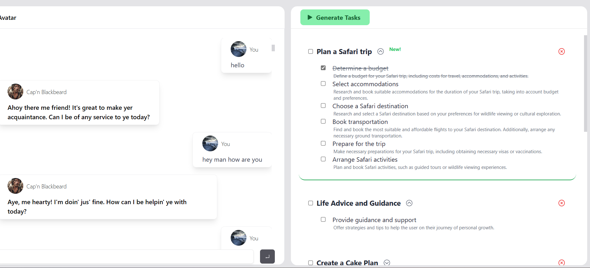

# Bestie AI - Chat with a Personality-Shifting AI Bot

Welcome to the **Bestie AI** project repository! Bestie AI is an innovative chatbot powered by cutting-edge AI technology, designed to provide users with a unique and engaging conversational experience. The bot has the ability to switch personalities, remember conversations through embeddings, and even generate tasks and subtasks in a checklist manner based on the context of the conversation. This repository contains the source code and documentation for Bestie AI, built using OpenAPI and Next.js.

## Features

- **Personality-Shifting Conversations:** Bestie AI brings conversations to life by simulating different personalities, providing users with dynamic and engaging interactions.

- **Conversation Embeddings:** The AI bot can remember past conversations and retrieve context from previous interactions, enhancing the overall conversation experience.

- **Task and Subtask Generation:** Bestie AI goes beyond traditional chatbots by assisting users in generating tasks and subtasks, organized in a checklist style, based on the ongoing conversation.


## Technologies Used

- **OpenAPI:** Bestie AI's backend is built using OpenAPI, allowing for a standardized and well-documented API structure.

- **Next.js:** The frontend of Bestie AI is developed using Next.js, providing a fast and dynamic user interface.

## Getting Started

Follow these steps to get started with Bestie AI on your local machine:

1. **Clone the Repository:** Begin by cloning this repository to your local machine using the following command:

   ```bash
   git clone https://github.com/your-username/bestie-ai.git
   ```

2. **Install Dependencies:** Navigate to the project directory and install the required dependencies for both the frontend and the backend:

   ```bash
   cd bestie-ai
   cd frontend
   npm install

   cd ../backend
   npm install
   ```

3. **Run the Application:** Start the frontend and backend servers simultaneously:

   ```bash
   cd frontend
   npm run dev

   cd ../backend
   npm start
   ```

4. **Access Bestie AI:** Open your web browser and go to `http://localhost:3000` to start chatting with Bestie AI and explore its features.

## API Documentation

The API documentation for Bestie AI can be found in the [`api-docs`](./api-docs) directory. It provides detailed information about the available endpoints, request and response structures, and usage examples.

## Contributing

We welcome contributions to Bestie AI from the community! If you'd like to contribute, please follow these steps:

1. Fork the repository and create a new branch for your feature or bug fix.

2. Make your changes and ensure that the code passes all tests.

3. Submit a pull request to the `main` branch of this repository.

## License

Bestie AI is released under the [MIT License](./LICENSE).

## Contact

For any questions, suggestions, or issues related to Bestie AI, please [open an issue](https://github.com/your-username/bestie-ai/issues) on GitHub.

Thank you for using Bestie AI, and we hope you enjoy engaging with our personality-shifting AI bot!